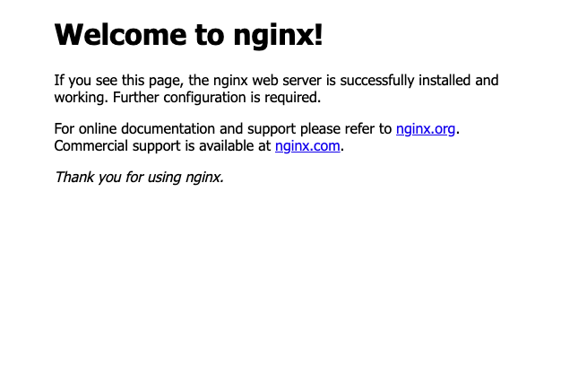

# Webサーバ基礎

## Webサーバとは

一度は聞いたことがあると思いますが、実際のところWebサーバとは何でしょう。

実は普段閲覧しているWebサイトは、Webサーバで構築されています。

他にもTwitterやInstagramなど、アプリを通じて使用するサービスの基盤を担う部分はWebサーバで提供されています。

---

### クライアントサーバモデル


Webサイトを閲覧するときは、Webブラウザを使用します。
ブラウザを通じてWebクライアントとなり、Webサーバにアクセスしています。
これをクライアントサーバモデルと呼び、私たちは知らない間にこれに基づいてWebサイトを閲覧しています。

---

## LAMPとは

Webサーバの主要素4つの頭文字を取ったものです。
全てOSS(無償)で使用できるものとなっております。

```txt
L: Linux
A: Apache
M: MySQL
P: PHP
```

Webサーバ登場初期は、上記を組み合わせて運用されていました。

現在では、使用される機会が少なくなっているものもありますが、
基本的にこのモデルに基づいてWebサーバが構築されています。

---

### Linux

Webサーバで使用されるOSのことです。
CentosやUbuntuが多く使われています。

---

### Apache

Webサーバの構築をするソフトウェアになります。
以前まではデファクトスタンダードでしたが、
最近ではNnigxやGo言語(プログラミング言語)で記述されたものを使用するケースが増加しています。

---

### MySQL

データベースソフトウェアです。
このデータベースに情報を保存して、プログラムを通してデータを書き込んだり変更したりして処理を実装していくことが多いです
他にも、OracleやPostgreSQLなどといったRDBMSがあります。

---

### PHP

サーバーサイドで使用するプログラミング言語です。
HTMLファイルではなくPHPファイルを使用することで、
動的WebServerを構築することが可能です。

PHP以外にもPerlやPython、Rubyなどのスクリプト系言語や、JavaやGoといったさまざまな言語での開発が可能です。

---

## Web Serverを構築する

Ubuntu20.04、NginxでWebサーバを構築する。

Docker環境の場合は、以下でコンテナを起動する。

```bash
docker run -it --rm -p 8080:80 -h webserver ubuntu:latest bash
```

Ubuntu上でで以下のコマンドを実行する。

```bash
apt update -y
apt install -y nginx

service nginx start
```

---

Nginxのインストール中にTimeZoneの入力を求められた場合は、
6(Asia),79(Tokyo)以下を入力する。

```log
Please select the geographic area in which you live. Subsequent configuration questions will narrow this down by presenting a list of cities, representing
the time zones in which they are located.

  1. Africa   3. Antarctica  5. Arctic  7. Atlantic  9. Indian    11. SystemV  13. Etc
  2. America  4. Australia   6. Asia    8. Europe    10. Pacific  12. US
Geographic area: 6

Please select the city or region corresponding to your time zone.

  1. Aden      11. Baku        21. Damascus     31. Hong_Kong  41. Kashgar       51. Makassar      61. Pyongyang  71. Singapore      81. Ujung_Pandang
  2. Almaty    12. Bangkok     22. Dhaka        32. Hovd       42. Kathmandu     52. Manila        62. Qatar      72. Srednekolymsk  82. Ulaanbaatar
  3. Amman     13. Barnaul     23. Dili         33. Irkutsk    43. Khandyga      53. Muscat        63. Qostanay   73. Taipei         83. Urumqi
  4. Anadyr    14. Beirut      24. Dubai        34. Istanbul   44. Kolkata       54. Nicosia       64. Qyzylorda  74. Tashkent       84. Ust-Nera
  5. Aqtau     15. Bishkek     25. Dushanbe     35. Jakarta    45. Krasnoyarsk   55. Novokuznetsk  65. Rangoon    75. Tbilisi        85. Vientiane
  6. Aqtobe    16. Brunei      26. Famagusta    36. Jayapura   46. Kuala_Lumpur  56. Novosibirsk   66. Riyadh     76. Tehran         86. Vladivostok
  7. Ashgabat  17. Chita       27. Gaza         37. Jerusalem  47. Kuching       57. Omsk          67. Sakhalin   77. Tel_Aviv       87. Yakutsk
  8. Atyrau    18. Choibalsan  28. Harbin       38. Kabul      48. Kuwait        58. Oral          68. Samarkand  78. Thimphu        88. Yangon
  9. Baghdad   19. Chongqing   29. Hebron       39. Kamchatka  49. Macau         59. Phnom_Penh    69. Seoul      79. Tokyo          89. Yekaterinburg
  10. Bahrain  20. Colombo     30. Ho_Chi_Minh  40. Karachi    50. Magadan       60. Pontianak     70. Shanghai   80. Tomsk          90. Yerevan
Time zone: 79
```

---

WebブラウザでWebサーバのIPアドレスにアクセスすると、以下の画面が表示され、Nginxがインストールされたことを確認できます。



---

デフォルトでは、`/var/www/html`に`index.nginx-debian.html`が配置されています。

```log
root@webserver:/# ls /var/www/html/
index.nginx-debian.html
```

このディレクトリに自身が作成したファイルを配置することで、
Webサイトを表示することができます。
